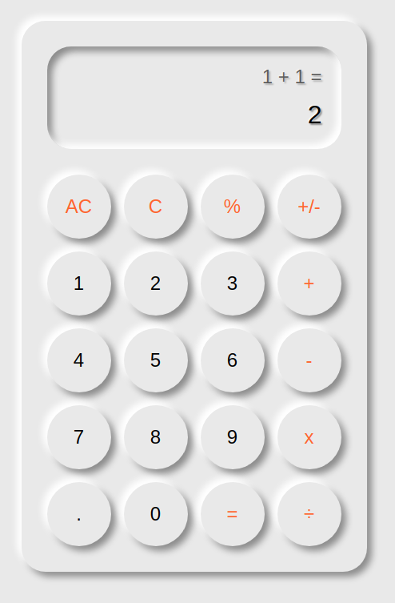

# Calculator (en cours)

Réalisé en : 
- **HTML**
- **SCSS**
- **JavaScript** *( Orienté objet )*

Utilisation de **dart-sass** pour compiler mon **.scss** en **.css**

Pour la compilation, j'effectue la commande suivante : `./dart-sass/sass assets/sass/style.scss assets/css/style.css --watch`
- **--watch** *permet de rafraîchir automatiquement le fichier style.css*

PS : pour l'instant, le projet n'est pas responcive, car je me concentre sur les fonctionnalités. Mes, je prévois de le rendre responcive à la fin.